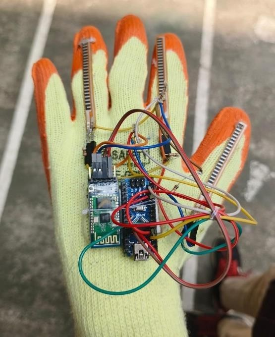
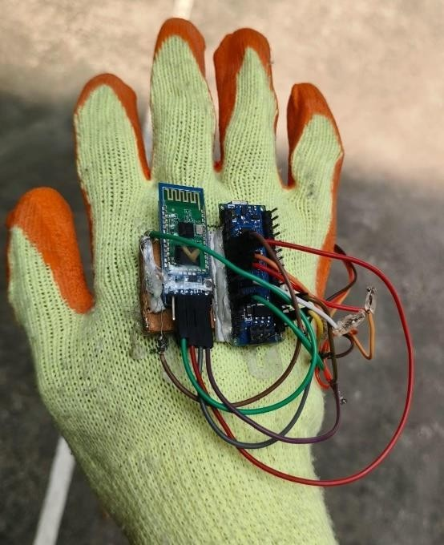
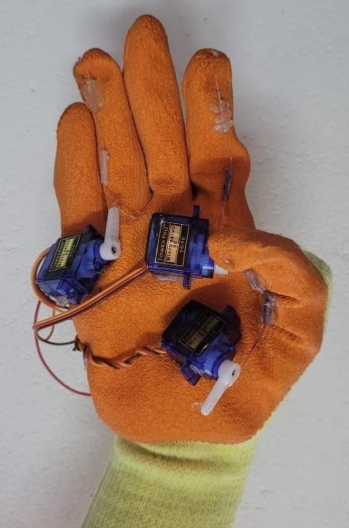
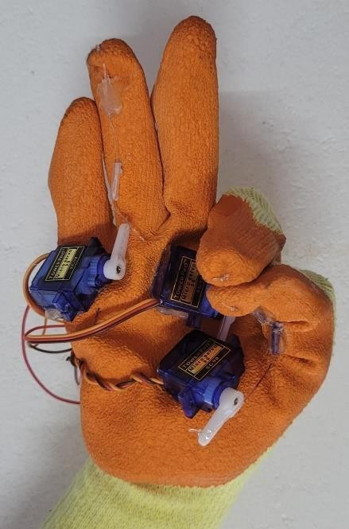
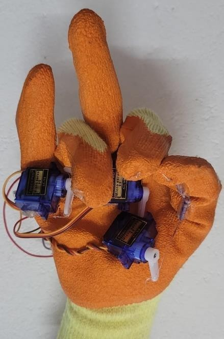
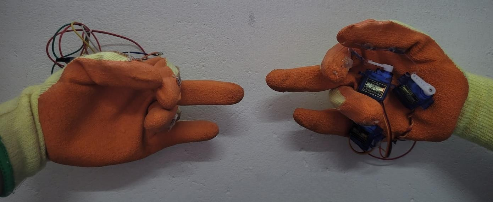
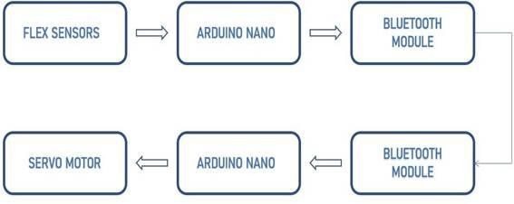
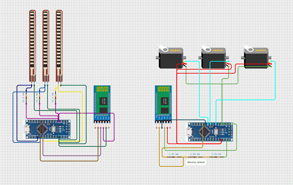

Physiotherapy Assistant System 🧤🤖

An Arduino-based wireless rehabilitation system that enables real-time mirroring of therapist hand movements to assist patients recovering from strokes, neuromuscular disorders, and hand injuries.

🔍 Overview

The project uses two gloves:
- Doctor’s Glove (Transmitter): Equipped with flex sensors to detect finger bending.
- Patient’s Glove (Receiver): Equipped with servo motors that replicate the same movement.

Communication between gloves happens wirelessly using HC-05 Bluetooth modules.

🎯 Objectives
- Real-time replication of finger movement for hand rehabilitation.
- Provide multiple therapy modes.
- Enable remote, therapist-less, consistent physiotherapy sessions.

🧠 System Modes

| Mode      | Function                                                                 |
|-----------|--------------------------------------------------------------------------|
| RTMODE    | Real-time mirroring of therapist's finger movements.                     |
| MOD1      | Single-finger movement for localized therapy.                            |
| MOD2      | Two-finger coordination training.                                        |
| MOD3      | Full-hand synchronized movement for strength & flexibility.              |

🛠️ Hardware Used

| Component             | Quantity | Description                                          |
|-----------------------|----------|------------------------------------------------------|
| Flex Sensors          | 3        | Detect finger bends                                  |
| Servo Motors          | 3        | Mirror finger motion on patient's glove              |
| Arduino Nano          | 2        | Main controller for each glove                       |
| Bluetooth HC-05       | 2        | Wireless data transfer                               |
| 1kΩ and 10kΩ Resistors| 6        | Voltage divider for sensor data and bluetooth module |
| Gloves                | 2        | Base for mounting sensors and motors                 |

⚙️ Software Details

- Language: C++ (Arduino)
- Communication: Bluetooth Serial (38400 baud)
- Commands: `RTMODE`, `MOD1`, `MOD2`, `MOD3`, `REPS 10`, `STOP`

🧪 System Performance

| Parameter            | Result                                |
|----------------------|---------------------------------------|
| Flex sensor accuracy | ~92%                                  |
| Bluetooth delay      | < 200ms (avg. ~50ms)                  |
| Servo motion         | Binary: 0° (rest) / 180° (bend)       |
| Power Supply         | Battery or USB from laptop (stable)   |

📂 File Structure

- `Doctor_Glove/doctor_glove_code.ino`: Transmitter glove code.
- `Patient_Glove/patient_glove_code.ino`: Receiver glove code.
- `Images/`: Contains **circuit diagram**, **block diagram**, **glove snapshots**, and **working mode visuals** (RTMODE, MOD1, MOD2, MOD3).
- `PHYSIOTHERAPY_ASSISTANT_SYSTEM.pdf`: Final report.

🧩 Future Improvements
- Add machine learning for adaptive therapy.
- Include haptic feedback for sensory reinforcement.
- Expand Bluetooth range and use battery-powered designs.
- Mobile app integration for monitoring & logs.

🧑‍💻 Team Members

- Harisankar Prasad
- Jitya Rejimon 
- Midhun P S
- Mohit U 

📄 License
This project is licensed under the [MIT License](LICENSE).

📸 Snapshots

📚 References
1. Imtiaz et al., *Development of Smart Glove*, IEEE ICCIT, 2023.  
2. Luz, F. M. da S., *Pose Estimation in Physiotherapy*, Master's Thesis, 2024.  
3. Rashid & Hasan, *Wearable Tech in Rehab*, Microelectronics Journal, 2019.  
...
(see full list in report)

